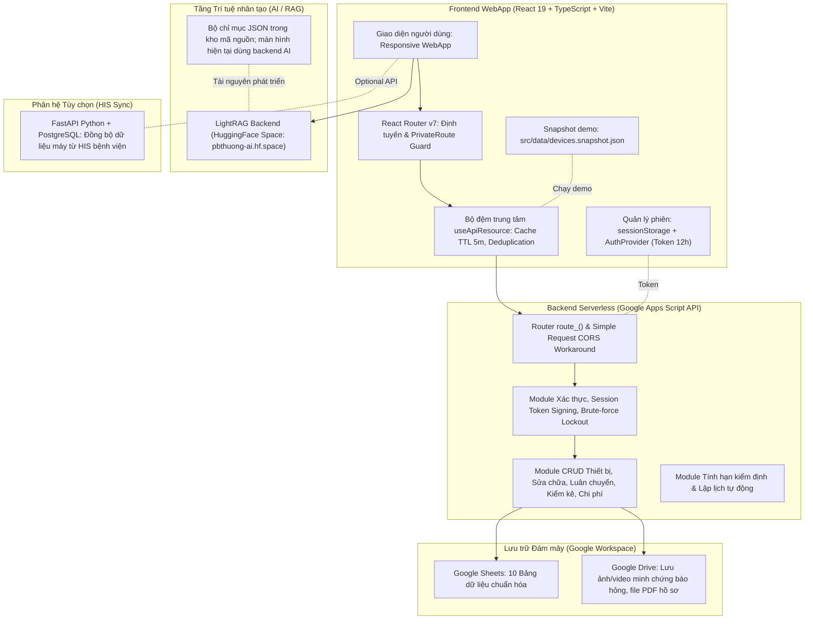
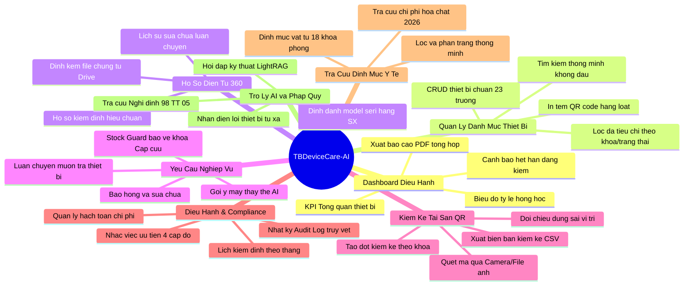
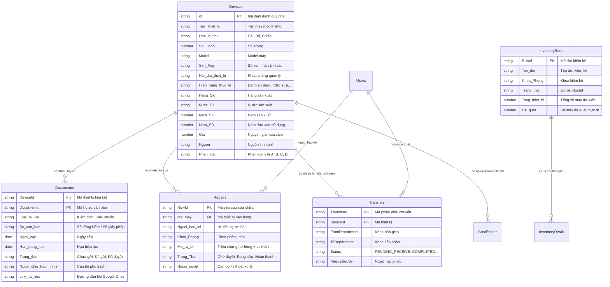

# TÀI LIỆU TỔNG HỢP NỘI DUNG DỰ ÁN
# TBDeviceCare-AI: HỆ THỐNG QUẢN LÝ VÒNG ĐỜI TRANG THIẾT BỊ Y TẾ SERVERLESS

---

> Cập nhật theo mã nguồn ngày 13/09/2026. Đây là tài liệu mô tả kỹ thuật, không thay thế biên bản nghiệm thu, kết quả đo thực tế hoặc ý kiến chuyên môn về hiệu lực văn bản pháp luật. Offline không thuộc phạm vi triển khai.

## I. THÔNG TIN CHUNG DỰ ÁN

- **Tên dự án:** TBDeviceCare-AI (Hệ thống quản lý vòng đời trang thiết bị y tế trên nền tảng Serverless, React và Google Workspace).
- **Tên sáng kiến kỹ thuật:** Xây dựng hệ thống thông tin quản lý vòng đời trang thiết bị y tế trên nền tảng Serverless, React và Google Workspace tại Trung tâm Y tế.
- **Lĩnh vực áp dụng:**
  1. *Công nghệ thông tin, chuyển đổi số y tế*: Ứng dụng WebApp Serverless, tự động hóa quy trình quản lý, giải phóng công việc hành chính.
  2. *Y – Dược cơ sở*: Tối ưu hóa việc quản lý, theo dõi, điều chuyển, bảo trì, kiểm định và nâng cao hiệu suất khai thác trang thiết bị y tế phục vụ khám, chữa bệnh.
- **Quy mô do đơn vị cung cấp (cần đối chiếu bản xuất dữ liệu khi nghiệm thu):**
  - **536+** trang thiết bị y tế và máy móc chuyên dụng.
  - **18** khoa/phòng chuyên môn và hành chính.
  - **70+** bộ hồ sơ kiểm định, hiệu chuẩn, cấp phép và văn bản pháp lý.
  - Hàng trăm lượt yêu cầu sửa chữa, điều chuyển và đợt kiểm kê tài sản.
- **Đơn vị phát triển & Thử nghiệm:** Trung tâm Y tế khu vực Thanh Ba, tỉnh Phú Thọ (thử nghiệm và áp dụng năm 2026).

---

## II. ĐẶT VẤN ĐỀ & MỤC TIÊU GIẢI PHÁP

### 1. Thực trạng & Thách thức tại cơ sở y tế tuyến huyện
- **Quản lý phân tán, thủ công:** Trước khi có hệ thống, thiết bị được theo dõi qua các file Excel rời rạc, sổ giao ban hoặc phiếu giấy. Dữ liệu dễ thất lạc, khó tra cứu tức thì thiết bị đang đặt tại khoa nào, ai phụ trách, còn hoạt động hay đang chờ sửa.
- **Chậm trễ trong quy trình báo hỏng – sửa chữa:** Khi thiết bị gặp sự cố, khoa lâm sàng phải báo qua điện thoại hoặc giấy đề xuất, thiếu luồng theo dõi tiến độ, thời gian phản hồi (SLA) và lưu vết phụ tùng thay thế.
- **Rủi ro pháp lý & an toàn người bệnh từ hạn kiểm định:** Thiết bị y tế bắt buộc phải kiểm định, hiệu chuẩn theo Nghị định 98/2021/NĐ-CP và Thông tư 05/2022/TT-BYT. Quản lý Excel thủ công khiến việc theo dõi ngày hết hạn dễ bị bỏ sót, tiềm ẩn nguy cơ mất an toàn điều trị.
- **Rào cản chi phí công nghệ:** Các phần mềm thương mại đắt đỏ (hàng trăm triệu đồng tiền bản quyền và phí duy trì hàng năm), đòi hỏi máy chủ riêng (server), chứng thư bảo mật và đội ngũ kỹ sư IT vận hành thường trực – điều kiện vượt quá ngân sách của trung tâm y tế cơ sở.

### 2. Mục tiêu cốt lõi của TBDeviceCare-AI
1. **Mục tiêu số hóa vòng đời thiết bị:** Từ tiếp nhận, bàn giao sử dụng, luân chuyển, bảo trì định kỳ, sửa chữa đến thanh lý.
2. **Giảm chi phí hạ tầng bằng Serverless:** Tận dụng tối đa hệ sinh thái Google Workspace (Google Apps Script, Google Sheets, Google Drive) làm backend và database đám mây.
3. **Định danh điện tử & Kiểm kê bằng mã QR:** Quét QR tức thì để xem hồ sơ bệnh án máy, báo hỏng tại chỗ, kiểm kê tài sản không chạm.
4. **Cảnh báo tuân thủ tự động (Compliance Engine):** Tự động tính toán hạn đăng kiểm, phân hạng cảnh báo (Khẩn cấp, Cần chuẩn bị, Đang xử lý) và tạo lịch công tác kiểm định theo tháng.
5. **Ứng dụng Trí tuệ nhân tạo (AI/RAG):** Trợ lý ảo tra cứu văn bản pháp quy y tế, sổ tay kỹ thuật và định mức tiêu hao vật tư năm 2026.
6. **Bảo mật & Trải nghiệm máy dùng chung:** Chống rò rỉ dữ liệu phiên làm việc tại các máy tính trực khoa, tối ưu tốc độ bằng bộ nhớ đệm đa tầng.

---

## III. KIẾN TRÚC HỆ THỐNG & CÔNG NGHỆ ÁP DỤNG



### 1. Bảng công nghệ (Tech Stack)
| Tầng kiến trúc | Công nghệ sử dụng | Vai trò & Đặc tính nổi bật |
|---|---|---|
| **Frontend Framework** | **React 19.2 + TypeScript 5.9** | Kiến trúc Single Page Application (SPA), gõ tĩnh nghiêm ngặt, hiệu năng cao. |
| **Build Tool** | **Vite 8.1** | Đóng gói siêu tốc, Hot Module Replacement (HMR), tối ưu bundle build. |
| **Định tuyến** | **React Router DOM 7.18** | Điều hướng route lồng nhau, phân quyền theo Role (`PrivateRoute`), Lazy loading component. |
| **Giao diện & Icon** | **Lucide React + Custom CSS Token** | Thiết kế chuẩn mực y tế, tương thích di động/máy tính bảng, bảng màu hiện đại. |
| **Biểu đồ & Thống kê** | **Chart.js 4.5 + React-Chartjs-2 5.3** | Trực quan hóa số liệu phân bổ thiết bị, tần suất hỏng hóc, xu hướng nhiệt độ GSP. |
| **Xử lý Mã QR** | **html5-qrcode + qrcode.react** | Sinh mã QR vector chuẩn xác và quét camera/tải ảnh trực tiếp trên trình duyệt. |
| **Xuất Báo cáo** | **jsPDF 4.2 + jspdf-autotable 5.0** | Tạo file PDF phiếu báo hỏng, biên bản bàn giao, danh mục kiểm định có bảng biểu chuẩn mực. |
| **Backend Chính** | **Google Apps Script (GAS)** | API Gateway Serverless, giảm chi phí máy chủ, tích hợp sâu Google Sheets/Drive. |
| **Cơ sở dữ liệu** | **Google Sheets API** | Cơ sở dữ liệu bảng tính đám mây, dễ dàng kiểm tra trực quan, cần cấu hình và kiểm tra quy trình sao lưu/khôi phục. |
| **Lưu trữ file** | **Google Drive API** | Lưu trữ ảnh minh chứng hư hỏng (tối đa 8 tệp/yêu cầu), video ngắn, tệp đính kèm. |
| **Trí tuệ nhân tạo (AI)** | **LightRAG + HuggingFace Space** | Mô hình RAG truy xuất đồ thị tri thức hỗ trợ kỹ thuật; màn hình hiện tại nhúng backend AI; không cam kết có fallback trên giao diện khi backend mất kết nối. |
| **Kiểm thử tự động** | **Node.js Test Runner + Playwright** | Kiểm tra nghiệp vụ backend, phiên đăng nhập và E2E trên Chromium desktop, Android mô phỏng và WebKit mô phỏng iPhone. Số test lấy từ kết quả chạy của phiên bản tương ứng. |

### 2. Các giải pháp kỹ thuật đột phá
- **Vượt rào cản CORS trên Google Apps Script (Simple Request Pattern):** Gửi payload qua request `POST` với `Content-Type: text/plain;charset=utf-8` chứa chuỗi JSON. Kỹ thuật này giúp trình duyệt bỏ qua bước preflight `OPTIONS` (vốn là điểm yếu của Apps Script), rút ngắn độ trễ mạng và không cần dựng thêm proxy trung gian.
- **Bộ đệm dữ liệu đa tầng `useApiResource` (Registry Pattern + Observer Pattern):**
  - Quản lý 3 tầng: `cacheRegistry` (lưu kết quả TTL 5 phút), `promiseRegistry` (chống trùng lặp request khi nhiều component cùng mount), và `subscriberRegistry` (đồng bộ trạng thái tức thì giữa các màn hình).
  - Hỗ trợ *Optimistic UI Update* (`mutate`): Khi duyệt yêu cầu sửa chữa hoặc cập nhật tài liệu, giao diện đổi trạng thái ngay lập tức trước khi server phản hồi, mang lại cảm giác phản hồi tức thì.
- **Bảo vệ dữ liệu trên máy tính dùng chung (Healthcare Shared Terminal Security):**
  - Phiên làm việc lưu hoàn toàn trong `sessionStorage` (giới hạn trong phiên tab; hành vi khôi phục tab phụ thuộc trình duyệt).
  - Token ký điện tử thời hạn 12 giờ (`SESSION_TTL_MS`).
  - Backend lọc bỏ toàn bộ thông tin nhạy cảm (`Mã PIN`, `Mật khẩu`) trước khi trả dữ liệu về máy khách.
  - Khi người dùng bấm **Đăng xuất**, hệ thống kích hoạt hàm quét dọn bộ nhớ (`clearApiResourceCache()` & `clearAuthSession()`), xóa cache do ứng dụng quản lý, bỏ kết quả request thuộc phiên cũ và xóa dữ liệu kiểm kê tạm của tài khoản trong sessionStorage. Đây không phải cam kết xóa toàn bộ bộ nhớ trình duyệt.
- **Dữ liệu trực tuyến:** Danh mục lấy từ Google Apps Script có xác thực. Snapshot đóng gói chỉ phục vụ demo/phát triển; không tự chuyển khi mất mạng và không phải tính năng offline cho người vận hành.
- **Độ mới dữ liệu:** Danh sách hiển thị thời điểm cập nhật và nút làm mới. Khi quay lại tab, bộ đệm quá hạn được tải lại. Nếu tải lỗi, giao diện cho biết dữ liệu có thể cũ và giữ khả năng thử lại.
- **Điện thoại:** Thanh điều hướng dưới, danh sách thiết bị dạng thẻ, thống kê hai cột, bộ lọc thu gọn, vùng bấm tối thiểu 44px cho tác vụ chính; hộp thoại hỗ trợ Escape và quản lý focus.

---

## IV. CÁC PHÂN HỆ VÀ TÍNH NĂNG CHI TIẾT



### 1. Phân hệ Tổng quan Điều hành (Dashboard)
- **KPI từ dữ liệu đã tải:** Tổng số máy, số máy hoạt động bình thường, số máy báo hỏng chờ duyệt, số máy đang sửa chữa, số thiết bị cảnh báo hạn kiểm định (trong 30 ngày) và số thiết bị đã quá hạn kiểm định.
- **Phân bổ theo Khoa/Phòng:** Biểu đồ hiển thị mật độ trang thiết bị phân bổ trên 18 khoa/phòng, hỗ trợ lãnh đạo nhận diện khoa tập trung nhiều tài sản giá trị cao.
- **Thống kê hư hỏng theo thời gian:** Biểu đồ cột thể hiện số ca sự cố phát sinh qua các tháng, giúp đánh giá độ bền và chu kỳ lão hóa của máy móc.
- **Xuất báo cáo giao ban:** Tích hợp nút xuất báo cáo nhanh định dạng PDF có chữ ký, phục vụ trực tiếp các buổi họp giao ban đầu tuần của Ban Giám đốc.

### 2. Phân hệ Danh mục & Hồ sơ điện tử 360° (Device List & Profile)
- **Tìm kiếm thông minh (Smart Search):** Hỗ trợ tìm kiếm tiếng Việt không dấu, tìm theo nhiều từ khóa rời rạc cùng lúc, tìm theo mã quản lý, tên máy, model, số seri hoặc hãng sản xuất.
- **Bộ lọc đa chiều:** Lọc theo khoa phòng sử dụng, lọc theo hiện trạng (Đang sử dụng, Chờ sửa, Đang sửa, Cảnh báo đăng kiểm, Quá hạn đăng kiểm, Thiết bị mới tiếp nhận).
- **Bộ trường dữ liệu chuẩn hóa (23 trường thông tin):** Mã thiết bị, tên máy, ĐVT, số lượng, model, số seri, nơi đặt, hiện trạng, hãng SX, nước SX, năm SX, năm SD, nguyên giá, nguồn kinh phí, phân loại y tế (A, B, C, D), đơn vị cung ứng, nhóm thiết bị, ghi chú kỹ thuật, ngày tạo, ngày cập nhật...
- **Hồ sơ điện tử 360° (`DeviceProfile.tsx`):**
  - *Tab Thông tin chung:* Toàn bộ lý lịch máy và mã QR code định danh chuẩn vector.
  - *Tab Hồ sơ pháp lý/Kiểm định:* Quản lý các loại giấy tờ: Kiểm định an toàn, Hiệu chuẩn, Giấy phép kiểm xạ, Bảo dưỡng định kỳ. Hiển thị ngày cấp, ngày hết hạn, số ngày còn lại (đổi màu cảnh báo Xanh - Vàng - Đỏ), người chịu trách nhiệm và link xem tài liệu gốc trên Google Drive.
  - *Tab Lịch sử sửa chữa & Luân chuyển:* Toàn bộ các ca báo hỏng trước đây và các lần mượn/trả giữa các khoa, giúp nắm rõ "tiền sử bệnh án" của từng thiết bị.
  - *Tác vụ nhanh tại chỗ:* Nút "Báo hỏng máy này", "Điều chuyển", "In mã QR" hoặc "Thêm hồ sơ mới".

### 3. Phân hệ Yêu cầu nghiệp vụ (Requests Hub)
Hợp nhất hai luồng nghiệp vụ phát sinh nhiều nhất tại bệnh viện:

#### A. Báo hỏng & Sửa chữa thiết bị (`RepairRequest.tsx`)
- Quét mã QR dán trên thân máy bằng camera điện thoại hoặc gõ nhanh mã máy/tên máy để form tự động điền thông tin.
- Nhập mô tả triệu chứng hư hỏng, chọn mức độ ưu tiên (*Bình thường* hoặc *Khẩn cấp*).
- **Đính kèm đa tệp (Multi-attachment):** Đính kèm tối đa **8 hình ảnh/video** ngắn ghi nhận hiện trạng hư hỏng (hỗ trợ JPG, PNG, WEBP, MP4, MOV; tối đa 12MB mỗi tệp và 16MB tổng đợt chọn). Ảnh được tối ưu về cạnh dài tối đa 1600px và WebP (JPEG dự phòng) khi trình duyệt hỗ trợ và kết quả nhỏ hơn bản gốc; video giữ nguyên. Tệp được xử lý lần lượt để giảm bộ nhớ đỉnh, biểu diễn bằng Base64 (không phải mã hóa bảo mật) và gửi đến backend để lưu Drive. Gửi lỗi giữ nội dung form để thử lại.
- Tự động gán danh tính người báo từ phiên làm việc (`userName`, `userEmail`, `Khoa/Phòng`).

#### B. Luân chuyển & Mượn trả thiết bị (`Transfers.tsx`)
- Lập phiếu đề xuất mượn thiết bị giữa các khoa/phòng khi xảy ra tình trạng đột biến bệnh nhân hoặc máy của khoa bị hỏng đột xuất.
- **Gợi ý thiết bị theo quy tắc (Recommendation Algorithm):** Khi một khoa cần mượn máy, thuật toán tự động quét toàn viện để tìm các khoa đang có cùng loại thiết bị nhưng có thiết bị phù hợp theo dữ liệu danh mục và quy tắc giữ tồn, đề xuất thiết bị để người phụ trách xem xét; không khẳng định có dữ liệu đo công suất sử dụng theo thời gian thực.
- **Chốt chặn an toàn kho cấp cứu (Stock Guard Protection):** Hệ thống cài đặt thuật toán kiểm tra nghiêm ngặt: Tuyệt đối không cho phép điều chuyển thiết bị ra khỏi các khoa trọng điểm như **Khoa Hồi sức cấp cứu (HSCC)** hoặc **Khoa Nhi** nếu thiết bị đó là thiết bị cuối cùng thuộc chủng loại đó tại khoa (ví dụ: máy thở, máy sốc tim, monitor cấp cứu).

### 4. Phân hệ Theo dõi & Duyệt yêu cầu (TrackDevices)
- **Phân quyền hiển thị (RBAC):**
  - *Tài khoản Quản trị viên (Admin/Tổ Trang thiết bị):* Xem toàn bộ danh sách báo hỏng và phiếu điều chuyển trong toàn viện; có quyền tiếp nhận, chuyển trạng thái "Đang kiểm tra", "Đang sửa chữa", "Đã sửa xong" hoặc "Từ chối".
  - *Tài khoản Khoa/Phòng:* Chỉ nhìn thấy các ca báo hỏng do khoa mình lập và các phiếu điều chuyển liên quan đến khoa mình (`fromDepartment` hoặc `toDepartment`).
- **Quy trình đóng vòng lặp khép kín:** Khi tổ sửa chữa hoàn thành, khoa lâm sàng kiểm tra lại máy và bấm "Xác nhận nhận lại máy", ca sửa chữa mới chính thức được chuyển sang trạng thái "Hoàn thành" (Completed) và ghi nhận vào lịch sử máy.
- **Hệ thống minh chứng (Evidence Links):** Tự động bóc tách các đường dẫn Drive thành nút bấm xem ảnh trực quan, hỗ trợ đối chiếu trước và sau khi sửa chữa.

### 5. Phân hệ Kiểm kê tài sản bằng mã QR (InventoryQr)
- **Tạo đợt kiểm kê linh hoạt:** Khởi tạo đợt kiểm kê định kỳ (Hàng quý/Hàng năm) hoặc kiểm kê đột xuất theo từng khoa/phòng cụ thể.
- **Đa phương thức quét mã:**
  1. *Quét trực tiếp qua Camera điện thoại/Laptop:* Nhận diện tức thì mã QR dán trên thân máy.
  2. *Tải ảnh chụp mã QR:* Cho phép chụp ảnh trước rồi tải ảnh lên để hệ thống tự giải mã.
  3. *Nhập tay mã quản lý / Số seri:* Dành cho trường hợp tem QR bị mờ hoặc rách.
- **Tự động đối chiếu hiện trạng:**
  - Thiết bị đúng khoa quản lý (`Đúng vị trí - OK`).
  - Thiết bị thuộc khoa khác nhưng đang nằm tại khoa kiểm kê (`Sai khoa/phòng`).
  - Đánh dấu tình trạng thực tế: Hoạt động tốt, Hư hỏng, Cần bảo trì.
- **Thống kê & Đồng bộ đám mây:** Hiển thị tức thì thanh tiến độ: Số máy đã kiểm kê / Tổng số máy của khoa, danh sách máy còn thiếu chưa thấy. Dữ liệu đợt kiểm kê được đẩy lên một Sheet riêng trên Google Sheets để lưu trữ lịch sử và hỗ trợ xuất biên bản kiểm kê dạng file CSV.

### 6. Phân hệ Điều hành công việc & Tuân thủ (Operations)
- **Lịch kiểm định trực quan (Monthly Inspection Calendar):** Hiển thị lịch kiểm định, kiểm xạ, hiệu chuẩn theo từng ngày trong tháng, giúp cán bộ phụ trách chủ động liên hệ các trung tâm kiểm định độc lập trước khi máy hết hạn.
- **Cảnh báo công việc 4 cấp độ (Task Priority Engine):**
  - **Khẩn cấp (Critical):** Hồ sơ đã quá hạn hoặc còn từ 0 đến 7 ngày -> Chuyển người phụ trách đánh giá và xử lý theo quy trình của đơn vị.
  - **Cao (High):** Còn trên 7 đến 30 ngày -> Bắt đầu lập tờ trình và chuẩn bị hồ sơ.
  - **Trung bình (Medium):** Thiết bị thiếu thông tin hạn kiểm định -> Cần rà soát bổ sung hồ sơ gốc.
  - **Thấp (Low):** Thiết bị còn hạn an toàn trên 30 ngày.
- **Nhật ký thay đổi (Audit Log):** Lưu vết toàn bộ các thao tác trọng yếu (Ai thêm máy, sửa thông tin, xóa chi phí, duyệt sửa chữa vào thời điểm nào).
- **Hạch toán chi phí bảo dưỡng/sửa chữa (Cost Tracking):** Quản lý chi tiết từng khoản chi phí phát sinh cho từng máy (Tiền sửa chữa, mua phụ tùng, đơn vị thực hiện, hóa đơn chứng từ liên quan), tổng hợp chi phí phục vụ quyết toán tài chính.
- **In ấn tem QR hàng loạt:** Chức năng chọn in toàn bộ tem mã QR cho cả một khoa/phòng ra khổ giấy A4/decal để dán đồng loạt lên thân máy.

### 7. Phân hệ Tra cứu Định mức Y tế 2026 (NormsLookup)
- **Số hóa danh mục định mức kỹ thuật:** Tích hợp toàn bộ dữ liệu định mức vật tư y tế tiêu hao, hóa chất và chi phí kỹ thuật năm 2026 của 18 khoa/phòng tại TTYT Thanh Ba.
- **Tra cứu siêu tốc:** Cho phép điều dưỡng, kỹ thuật viên và bác sĩ tra cứu tức thì mã kỹ thuật, danh mục vật tư định mức cho từng ca mổ, thủ thuật hoặc xét nghiệm.
- **Làm sạch dữ liệu hiển thị:** Hệ thống có bộ lọc phát hiện và loại giá trị lỗi công thức Excel khỏi phần hiển thị; không sửa tệp Excel gốc chứa (`#VALUE!`, `#REF!`), tự động phân trang (50 dòng/trang) giúp hiển thị mượt mà trên mọi thiết bị.

### 8. Phân hệ Thống kê & Báo cáo (Reports)
- **Báo cáo chuyên sâu:**
  - Báo cáo chi tiết các ca sửa chữa theo khoảng thời gian và theo từng khoa.
  - Báo cáo hiện trạng pháp lý hồ sơ (Số lượng máy còn hạn, sắp hết hạn, hết hạn, tỷ lệ hồ sơ đã gửi/đã duyệt).
- **Xuất dữ liệu 2 định dạng:**
  - *Xuất CSV:* Để nhập vào phần mềm kế toán hoặc tiếp tục phân tích nâng cao trên Microsoft Excel.
  - *Xuất PDF:* Bản in trang trọng có tiêu đề đơn vị, bảng biểu căn lề chuẩn mực và chân trang ký duyệt.

### 9. Phân hệ Trợ lý AI Thông minh (AIAssistant & RAG Service)
- **Tích hợp mô hình LightRAG:** Kết nối với Backend RAG đồ thị tri thức triển khai trên HuggingFace Space.
- **Kho tri thức văn bản pháp quy y tế:**
  - Nghị định 98/2021/NĐ-CP và Nghị định 117/2020/NĐ-CP (Quản lý và xử phạt vi phạm TTBYT).
  - Thông tư 05/2022/TT-BYT và Thông tư 19/2021/TT-BYT (Quy định chi tiết và mẫu văn bản TTBYT).
  - Quyết định 7115/QĐ-BYT (Quy trình thanh kiểm tra TTBYT).
  - Tài liệu định mức kỹ thuật năm 2026.
- **Khả năng giải đáp:** Nhân viên y tế có thể hỏi đáp tự nhiên bằng tiếng Việt: *"Máy siêu âm 4D phải kiểm định bao lâu một lần?", "Quy trình lập hồ sơ thanh lý máy X-quang hỏng?", "Định mức găng tay vô khuẩn khoa Ngoại năm 2026 là bao nhiêu?"* – Chất lượng câu trả lời và trích dẫn phụ thuộc backend AI và dữ liệu được lập chỉ mục. Người phụ trách phải đối chiếu nguồn gốc, ngày hiệu lực và phạm vi áp dụng; bản frontend hiện nhúng giao diện backend qua iframe.

### 10. Phân hệ Theo dõi Nhiệt độ/Độ ẩm GSP (GspLog)
- Theo dõi điều kiện bảo quản thuốc và hóa chất xét nghiệm tại kho dược và các tủ lạnh chuyên dụng theo chuẩn Thực hành tốt bảo quản thuốc (GSP).
- Cảnh báo trực quan khi nhiệt độ vượt ngưỡng an toàn (Kho: 15°C - 30°C; Tủ lạnh: 2°C - 8°C; Độ ẩm: 40% - 75%).
- Vẽ biểu đồ biến thiên nhiệt độ tự động theo chu kỳ 30 ngày.

---

## V. CƠ SỞ DỮ LIỆU & CẤU TRÚC GOOGLE SHEETS

Hệ thống sử dụng bảng tính Google Sheets làm kho dữ liệu dạng bảng có các khóa liên kết do ứng dụng quản lý với 10 sheet chuyên biệt:



---

## VI. AN TOÀN THÔNG TIN & BẢO MẬT DỮ LIỆU

1. **Cơ chế xác thực không lộ mật khẩu:**
   - Đăng nhập qua giao thức `POST` gửi mã PIN.
   - Backend Google Apps Script mã hóa/kiểm tra và chỉ trả về `sessionToken` kèm thông tin cơ bản; tự động lọc bỏ các trường `Mã PIN`, `Mật khẩu`, `Password` ra khỏi response JSON.
2. **Chống tấn công vét cạn (Brute-force Protection):**
   - Giới hạn tối đa **5 lần thử** sai mã PIN trong vòng **15 phút**. Nếu vượt quá, tài khoản bị tạm khóa để bảo vệ hệ thống.
3. **Phân quyền người dùng dựa trên vai trò (RBAC):**
   - `Admin`: Toàn quyền cấu hình hệ thống, tạo/sửa/xóa thiết bị, duyệt mọi ca sửa chữa, quản lý tài khoản, điều chuyển máy, quản lý chi phí.
   - `User` (Khoa/Phòng): Tra cứu danh mục thiết bị sau khi đăng nhập; danh mục hiện không giới hạn tuyệt đối theo khoa ở backend. Có thể lập báo hỏng, nhận thông báo cập nhật, tiếp nhận/từ chối thiết bị luân chuyển đến khoa mình.
4. **Dọn bộ nhớ đệm theo phiên:**
   - Ứng dụng chạy trên máy tính bàn giao ca trực tại phòng trực điều dưỡng/bác sĩ. Khi bấm Đăng xuất, token, cache ứng dụng và lịch sử kiểm kê tạm của tài khoản được dọn. Bản lưu kiểm kê cũ dùng chung localStorage không được tự nạp sang tài khoản mới; dữ liệu cũ không bị tự xóa để tránh mất bản chưa đồng bộ. Chỉ dữ liệu đã được backend xác nhận mới được xem là đã lưu trên máy chủ.

---

## VII. HƯỚNG DẪN CÀI ĐẶT & VẬN HÀNH HỆ THỐNG

### 1. Cấu hình môi trường (`.env.local` hoặc `.env`)
```bash
# URL Web App Google Apps Script đã deploy (exec)
VITE_THIET_BI_API_URL=https://script.google.com/macros/s/AKfycbxhaOjofUhw78hxAbg7P3LcQcMRHHqPQvzU67TaoVReUCGHi_-y060TzSgvGlS3HO8KSQ/exec

# Địa chỉ Backend Trợ lý AI LightRAG (HuggingFace Spaces hoặc Localhost)
VITE_AI_API_URL=https://pbthuong-ai.hf.space

# Đường dẫn cơ sở (Base path) khi host trên subpath (vd: /webapp/)
VITE_BASE_PATH=/

# Chế độ demo/phát triển bằng snapshot; vận hành thực tế giữ false
VITE_USE_LOCAL_SNAPSHOT=false
```

### 2. Các câu lệnh thao tác mã nguồn
- **Cài đặt thư viện phụ thuộc:**
  ```bash
  npm install
  ```
- **Khởi chạy môi trường phát triển (Local Dev):**
  ```bash
  npm run dev
  ```
- **Xây dựng chỉ mục định mức kỹ thuật 2026:**
  ```bash
  npm run build:norms
  ```
- **Xây dựng chỉ mục kho tri thức pháp quy (RAG):**
  ```bash
  npm run build:rag
  ```
- **Chạy toàn bộ kiểm thử nghiệp vụ (Unit Tests):**
  ```bash
  npm test
  ```
- **Chạy kiểm thử giao diện đầu cuối (E2E Tests Playwright):**
  ```bash
  npm run test:e2e
  ```
- **Biên dịch bản sản xuất (Production Build):**
  ```bash
  npm run build
  ```

---

## VIII. ĐÁNH GIÁ HIỆU QUẢ KINH TẾ – XÃ HỘI

### 1. Hiệu quả kinh tế
- **Chi phí cần đo khi nghiệm thu:** Lập bảng tổng chi phí Google Workspace/Drive, quota Apps Script, AI, sao lưu, bảo trì và hỗ trợ. Chưa có căn cứ để khẳng định tiết kiệm 100% hay một số tiền cụ thể nếu chưa có báo giá và số liệu vận hành đối chứng.
- **Kéo dài tuổi thọ thiết bị:** Nhờ quy trình báo hỏng tức thì và bảo trì định kỳ đúng hạn, các sự cố hỏng hóc nhỏ được phát hiện và xử lý sớm, hạn chế nguy cơ cháy nổ board mạch hoặc hỏng hóc linh kiện đắt tiền.
- **Tối ưu hóa nguồn lực tài sản công:** Tính năng luân chuyển giúp điều phối thiết bị từ khoa nhàn rỗi sang khoa có nhu cầu cao, tránh mua sắm lãng phí, trùng lặp.

### 2. Hiệu quả xã hội và quản lý y tế
- **Nâng cao an toàn người bệnh:** Thiết bị điều trị (máy sốc tim, máy thở, bơm tiêm điện) được theo dõi hạn và nhắc người phụ trách kiểm tra; phần mềm không tự xác nhận tình trạng an toàn hoặc độ chính xác kỹ thuật.
- **Giảm áp lực hành chính cho nhân viên y tế:** Điều dưỡng và kỹ thuật viên có thể quét QR để báo hỏng máy; thời gian thao tác cần được đo trên điện thoại và mạng thực tế ngay tại đầu giường bệnh nhân thay vì phải viết giấy và chạy đi xin chữ ký duyệt.
- **Minh bạch hóa tài sản công:** Mọi lịch sử sửa chữa, điều chuyển, chi phí và văn bản kiểm định được lưu vết khi thao tác backend hoàn tất, phục vụ hiệu quả các đợt thanh tra, kiểm toán nhà nước.
- **Khả năng nhân rộng vượt trội:** Mô hình có thể đóng gói và triển khai dễ dàng cho mọi bệnh viện tuyến huyện, trung tâm y tế khu vực hoặc trạm y tế xã trên toàn quốc sau khi cấu hình tài khoản, quyền truy cập, dữ liệu ban đầu và kiểm thử nghiệm thu.


## IX. PHẠM VI KIỂM THỬ VÀ VẬN HÀNH

- Các lệnh nghiệm thu mã nguồn: `npm run lint`, `npm test`, `npm run build`, `npm run test:e2e`.
- Cài bộ chạy trình duyệt: `npx playwright install chromium webkit`.
- E2E dùng tài khoản và API giả lập, không tạo dữ liệu trên Google Sheets thật. Mô phỏng điện thoại không thay thế kiểm thử camera, bàn phím, mạng yếu và quyền truy cập trên thiết bị thật.
- Các thay đổi frontend cần build/deploy mới mới có hiệu lực trên website. Commit mã nguồn không đồng nghĩa đã triển khai.
- Camera kiểm kê ưu tiên camera sau, có nhập tay/ảnh dự phòng; mã phải khớp duy nhất một thiết bị. Không tự nhận thiết bị từ chuỗi mã ngắn trùng một phần.
- Phiếu báo hỏng mới phải chọn máy rõ ràng; chọn qua hồ sơ/QR vẫn điền sẵn có chủ đích. Hủy hộp thoại duyệt không gửi lệnh duyệt.
- Chưa công bố SLA, thời gian báo hỏng trung bình, công suất sử dụng thiết bị hoặc tiết kiệm tài chính nếu chưa có số đo. Các mô hình báo cáo mở rộng cần dữ liệu và tiêu chí nghiệm thu riêng.
- Không bổ sung offline/PWA/hàng đợi đồng bộ nền trong bản sửa này.
