# Phụ lục TBDeviceCare-AI

Tài liệu này dùng cho hồ sơ mô tả giải pháp TBDeviceCare-AI. Nội dung được đối chiếu với mã nguồn WebApp hiện có: React + TypeScript + Vite, Google Apps Script/Google Sheets, Google Drive, module QR, module báo hỏng/sửa chữa và trợ lý AI nhúng qua HuggingFace Space.

## Phụ lục 1. Sơ đồ kiến trúc nền tảng và luồng dữ liệu tổng thể

### 1.1. Kiến trúc nền tảng

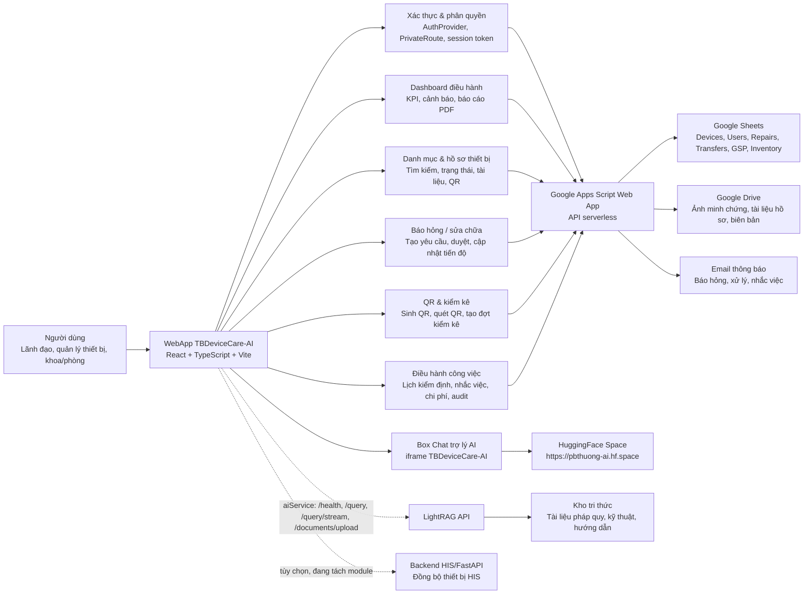

### 1.2. Luồng dữ liệu tổng thể

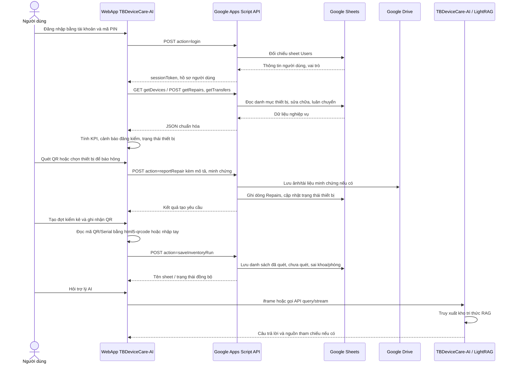

### 1.3. Diễn giải chính xác theo module hiện có

- Lớp giao diện là WebApp React/TypeScript/Vite, điều hướng qua các route chính: Tổng quan, Quản lý thiết bị, Tạo yêu cầu, Theo dõi thiết bị, Kiểm kê QR, Điều hành công việc, Thống kê & báo cáo và AI Trợ lý.
- Lớp backend chính là Google Apps Script Web App. Các action quan trọng gồm `login`, `getDevices`, `getRepairs`, `reportRepair`, `approveRepair`, `getTransfers`, `saveInventoryRun`, `deleteInventoryRun`, `addDocument`.
- Lớp dữ liệu sử dụng Google Sheets cho dữ liệu có cấu trúc và Google Drive cho tài liệu/ảnh minh chứng.
- QR được sinh trong WebApp bằng `qrcode.react`; QR thường mã hóa đường dẫn hồ sơ thiết bị dạng `/devices/{deviceId}`. Khi quét, WebApp trích xuất URL/Serial và đối chiếu với danh mục thiết bị.
- Luồng kiểm kê QR hỗ trợ tạo đợt kiểm kê, nhập mã thủ công, quét camera, quét từ ảnh, ghi nhận tình trạng, thống kê thiết bị đã quét/chưa quét/sai khoa phòng và xuất CSV.
- AI hiện được hiển thị trong WebApp qua iframe `https://pbthuong-ai.hf.space`. Mã nguồn cũng có lớp `aiService` để gọi LightRAG API khi tích hợp trực tiếp, có kiểm tra sức khỏe, truy vấn streaming, upload tài liệu và fallback nội bộ.
- Module HIS/FastAPI tồn tại ở backend nhưng là nhánh tùy chọn, không phải luồng vận hành chính của WebApp hiện tại.

## Phụ lục 2. Hình ảnh demo giao diện WebApp thực tế

Nguồn ảnh: chụp từ WebApp local ngày 30/06/2026, dùng dữ liệu snapshot nội bộ để demo ổn định. Các số liệu thể hiện đúng trạng thái snapshot tại thời điểm chụp, ví dụ Dashboard ghi nhận 536 thiết bị quản lý, 444 thiết bị ổn định, 21 hồ sơ hết hạn đăng kiểm và 1 cảnh báo đăng kiểm.

### Hình 2.1. Giao diện Tổng quan Dashboard

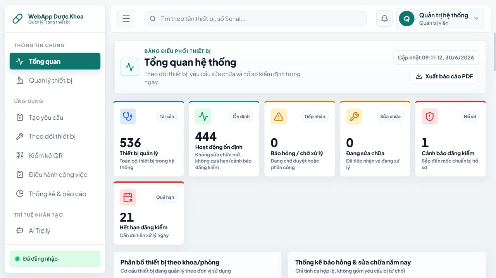

Dashboard cung cấp lớp điều hành tổng hợp cho lãnh đạo và bộ phận quản lý thiết bị: tổng số thiết bị, thiết bị ổn định, báo hỏng/chờ xử lý, đang sửa chữa, cảnh báo đăng kiểm, quá hạn đăng kiểm, phân bổ theo khoa/phòng và thống kê báo hỏng/sửa chữa.

### Hình 2.2. Giao diện quy trình Báo hỏng / Sửa chữa thiết bị

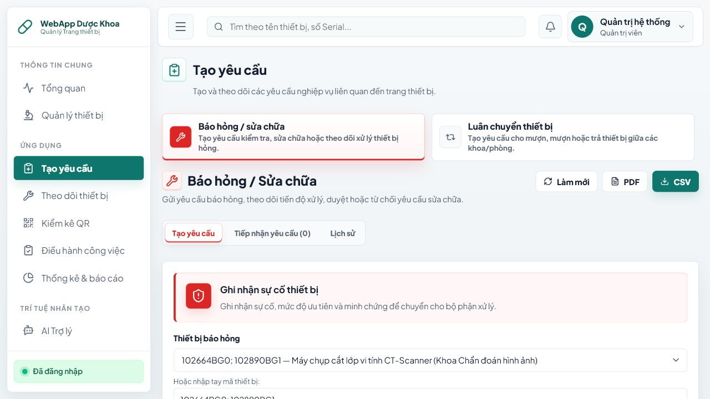

Quy trình báo hỏng cho phép chọn thiết bị từ danh mục hoặc quét QR trên thiết bị, nhập mô tả sự cố, chọn mức ưu tiên và gửi yêu cầu để bộ phận phụ trách tiếp nhận. Màn hình cũng có các tab theo dõi yêu cầu đang xử lý và lịch sử xử lý, hỗ trợ xuất PDF/CSV phục vụ báo cáo.

### Hình 2.3. Giao diện Box Chat với Trợ lý AI TBDeviceCare-AI

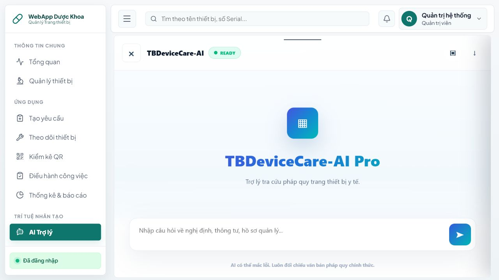

Trợ lý AI được nhúng trực tiếp trong WebApp. Người dùng có thể nhập câu hỏi về quy định, thông tư, hồ sơ quản lý, tài liệu kỹ thuật hoặc hướng xử lý ban đầu. Giao diện có trạng thái sẵn sàng và khuyến cáo người dùng đối chiếu với văn bản/quy trình chính thức.

## Phụ lục 3. Minh chứng số hóa tài sản bằng QR Code

### 3.1. Hệ thống sinh mã QR tự động trong WebApp

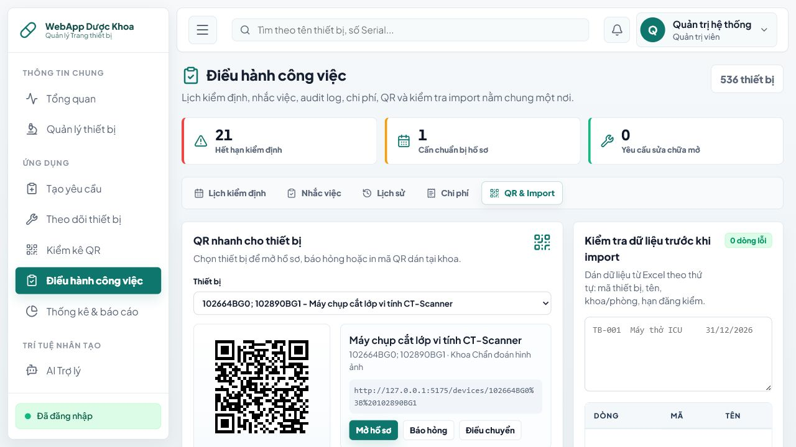

Mã QR được sinh tự động theo từng thiết bị. Ví dụ ảnh chụp cho thấy thiết bị "Máy chụp cắt lớp vi tính CT-Scanner" có mã/serial `102664BG0; 102890BG1`, liên kết tới hồ sơ thiết bị trên WebApp. Từ màn hình này người dùng có thể mở hồ sơ, tạo yêu cầu báo hỏng hoặc điều chuyển thiết bị.

### 3.2. Module kiểm kê QR tại hiện trường

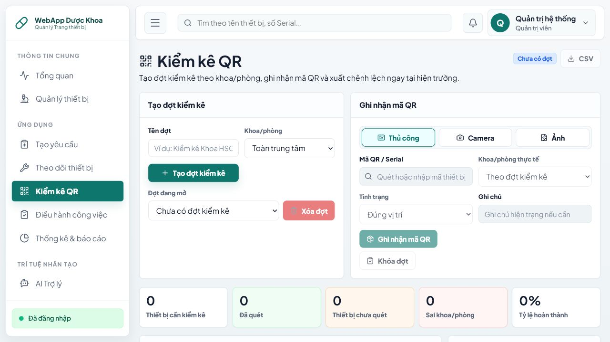

Module kiểm kê QR hỗ trợ tạo đợt kiểm kê theo khoa/phòng, ghi nhận mã QR/Serial bằng nhập tay, camera hoặc ảnh chụp, chọn tình trạng thiết bị, ghi chú hiện trạng, khóa đợt kiểm kê và xuất CSV. Đây là lớp nghiệp vụ dùng để biến QR dán trên thiết bị thành dữ liệu kiểm kê có thể tổng hợp.

### 3.3. Ảnh minh họa AI cho tem QR dán trên thiết bị y tế

Các ảnh dưới đây được tạo bằng AI để minh họa phần chưa có ảnh chụp hiện trường. Khi dùng trong hồ sơ chính thức, nên ghi chú là "ảnh minh họa" hoặc thay bằng ảnh thật do đơn vị chụp tại các khoa lâm sàng.

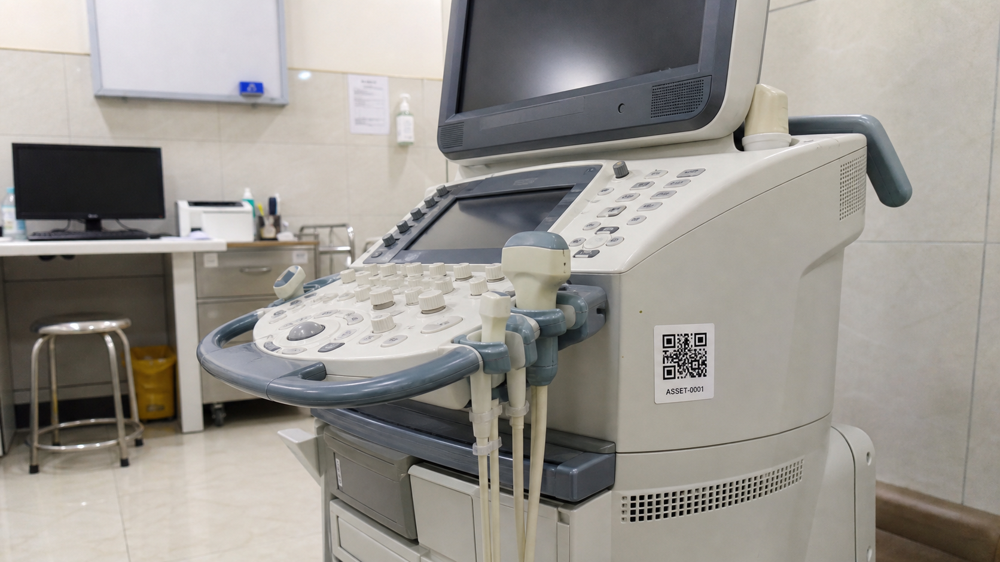

Hình 3.3. Ảnh minh họa tem QR được dán trên thiết bị đang sử dụng tại khoa lâm sàng, phục vụ tra cứu hồ sơ và báo hỏng nhanh qua WebApp TBDeviceCare-AI.

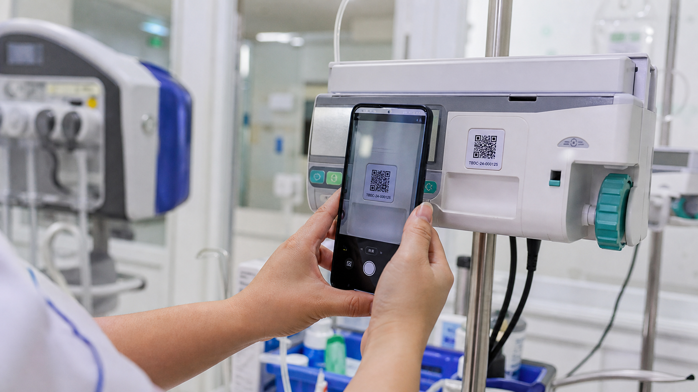

Hình 3.4. Ảnh minh họa thao tác nhân viên y tế quét QR để mở hồ sơ thiết bị, kiểm tra thông tin quản lý và ghi nhận yêu cầu sửa chữa/kiểm kê.

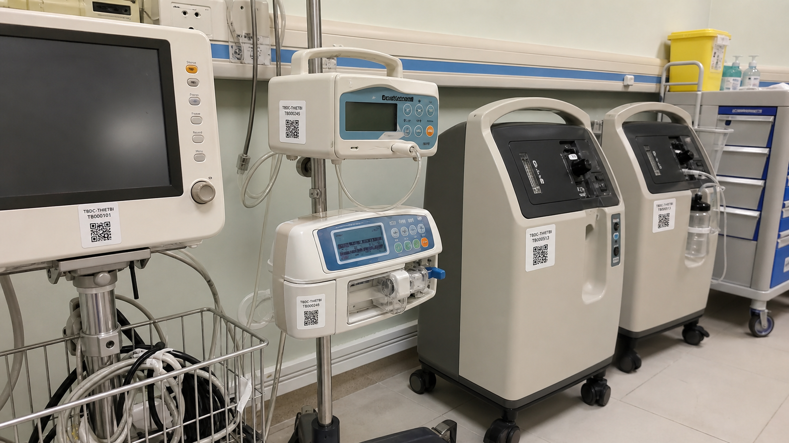

Hình 3.5. Ảnh minh họa hệ thống mã QR được triển khai đồng bộ trên nhiều thiết bị, giúp chuẩn hóa nhận diện tài sản và rút ngắn thời gian tra cứu tại hiện trường.

Nếu thay bằng ảnh thật, ảnh minh chứng nên có:

- Ảnh thấy rõ tem QR đã dán trên thân thiết bị, không chỉ là ảnh mã QR trên màn hình.
- Nên có tên thiết bị, serial hoặc vị trí khoa/phòng nếu không chứa thông tin nhạy cảm.
- Không để lộ thông tin người bệnh, hồ sơ bệnh án hoặc dữ liệu cá nhân.
- Mỗi ảnh nên ghi ngày chụp, khoa/phòng, tên thiết bị và mã thiết bị tương ứng trong WebApp.

### 3.4. Quy trình số hóa tài sản bằng QR

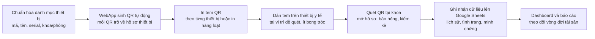
