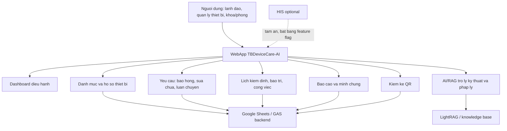

# Ke hoach thiet ke va bo sung tinh nang TBDeviceCare-AI

Tai lieu nay duoc lap sau khi doc file `Ban mo ta giai phap du thi.docx` va doi chieu voi ma nguon hien tai cua du an `quan-ly-trang-thiet-bi`.

## 1. Dinh huong tu ban mo ta giai phap

Giai phap du thi mo ta TBDeviceCare-AI la he thong quan ly trang thiet bi y te tap trung, ket hop:

- Co so du lieu tap trung tren nen tang dam may.
- Quan ly ho so, ly lich, tai lieu phap ly va tai lieu ky thuat cua thiet bi.
- Dinh danh thiet bi bang QR.
- Quy trinh bao hong, sua chua, bao tri, bao duong, kiem dinh, hieu chuan, kiem xa.
- Tu dong canh bao cac moc den han.
- Kiem ke tai san bang ung dung/QR.
- AI/RAG de tra cuu tai lieu ky thuat, huong dan su dung va xu ly loi.
- Bao cao hieu qua, so lieu su dung, khao sat hai long va minh chung ap dung thuc te.

Muc tieu san pham nen giu la: ung dung van hanh noi bo cho co so y te tuyen co so, uu tien thao tac nhanh, du lieu ro rang, it phu thuoc ha tang phuc tap va co minh chung phuc vu ho so du thi.

## 2. Hien trang module trong du an

| Nhom module | Hien co trong app | Danh gia | Huong xu ly |
|---|---|---|---|
| Tong quan dieu hanh | `Dashboard` co KPI, bieu do, thong ke sua chua, trang thai thiet bi, xuat PDF | Manh hon ban mo ta co ban | Giu va bo sung lop chi so "hieu qua sau ap dung" |
| Danh muc thiet bi | `DeviceList`, CRUD, loc trang thai, tim kiem thong minh, in QR hang loat | Phu hop doc | Giu, them truong vong doi va nhap lieu chuan hoa |
| Ho so thiet bi | `DeviceProfile`, QR, tai lieu kiem dinh, bao hong tu ho so | Rat quan trong | Nang thanh "Ho so dien tu 360" |
| Bao hong/sua chua | `RepairRequest`, `TrackDevices`, hinh anh minh chung, duyet/tien do, PDF/CSV | Phu hop doc | Giu, them SLA thoi gian phan hoi/khac phuc |
| Luan chuyen/muon tra | `Transfers`, de xuat thiet bi trong cung loai, guard ton kho HSCC/Nhi | Tinh nang xin hon doc | Giu lai, dua thanh module quan ly khai thac thiet bi |
| Lich kiem dinh/bao tri | `Operations`, calendar, task, workflow, audit, chi phi | Phu hop va nang cao | Giu, them checklist ke hoach theo thang/quy |
| QR va import | `DeviceList`, `Operations`, QR profile va QR workspace | Phu hop doc | Giu, them module kiem ke QR rieng |
| Bao cao | `Reports`, PDF/CSV, ho so kiem dinh, sua chua | Phu hop doc | Bo sung bao cao minh chung du thi |
| AI/RAG | `AIAssistant`, `aiService`, `legalRagService`, LightRAG backend | Diem moi chinh cua giai phap | Giu va nhung AI vao ngu canh thiet bi |
| GSP | `GspLog` ton tai nhung chua co route hien thi chinh | Ngoai pham vi TTBYT nhung co gia tri duoc khoa | De o module mo rong |
| HIS | `HisDevices`, backend HIS ton tai nhung dang tam an | Tich hop nang, chua on dinh | Giu code, chi bat lai khi on dinh bang feature flag |

## 3. Kien truc module de thiet ke lai

## 4. Cac tinh nang xin hon can giu lai

1. Tim kiem thong minh khong dau va nhieu tu khoa trong danh sach thiet bi.
2. Phan loai trang thai thiet bi tu nhieu nguon du lieu: hoat dong tot, bao hong, dang sua, het han, sap het han, chua phan bo.
3. In QR hang loat va QR theo tung thiet bi.
4. Ho so thiet bi co tab tai lieu, QR, bao hong nhanh.
5. Bang yeu cau hop nhat cho bao hong/sua chua va luan chuyen.
6. Luan chuyen theo loai thiet bi truoc, admin gan may cu the sau.
7. AI de xuat thiet bi trong cung loai khi co yeu cau muon.
8. Guard khong dieu chuyen het thiet bi cung loai khoi khoa HSCC/Nhi.
9. Evidence links cho anh/chung tu trong mo ta yeu cau.
10. Lich kiem dinh, audit log va chi phi sua chua/bao tri trong `Operations`.
11. Xuat PDF/CSV cho dashboard, yeu cau va bao cao.
12. Local snapshot mode de demo khi chua ket noi Google Apps Script.
13. AI/RAG co kha nang upload tai lieu va stream cau tra loi tu backend.

## 5. Tinh nang can bo sung theo muc uu tien

### P0 - Nen lam truoc de khop ban mo ta du thi

#### 5.1. Ho so dien tu thiet bi 360

Muc tieu: moi thiet bi co mot ho so day du, dung de tra cuu, in QR, bao hong, kiem dinh va minh chung.

Can bo sung:

- Tab "Thong tin chung": ma thiet bi, ten, model, serial, hang san xuat, nam san xuat, khoa quan ly, vi tri.
- Tab "Vong doi": tiep nhan, ban giao, dua vao su dung, dieu chuyen, sua chua, thanh ly.
- Tab "Ho so phap ly": CO, CQ, nghiem thu, hop dong, bao hanh, kiem dinh, hieu chuan, kiem xa.
- Tab "Tai lieu ky thuat": HDSD, manual, SOP rut gon, video/anh minh hoa neu co.
- Tab "Nhat ky": bao hong, sua chua, bao tri, bao duong, luan chuyen, kiem ke.
- Nut tac vu nhanh: Bao hong, Tao lich bao tri, In QR, Tai PDF ho so.

#### 5.2. Ke hoach bao tri, bao duong, kiem dinh

Muc tieu: chuyen tu canh bao han dang kiem sang quan ly lich ky thuat day du.

Can bo sung:

- Kieu cong viec: bao tri, bao duong, kiem dinh, hieu chuan, kiem xa, bao hanh.
- Tan suat: theo thang/quy/nam hoac ngay tuy chinh.
- Nguoi phu trach, khoa phoi hop, nha cung cap.
- Trang thai: chua lam, dang xu ly, da nop ho so, hoan thanh, qua han.
- Tu dong tao nhac viec truoc han 30/15/7 ngay.
- Lich thang/quy va danh sach viec den han.

#### 5.3. Module kiem ke QR

Muc tieu: bien phan "kiem ke tai san bang QR" trong DOCX thanh module rieng.

Can bo sung:

- Tao dot kiem ke theo khoa/phong.
- Quet QR de ghi nhan thiet bi co mat tai vi tri.
- Cap nhat nhanh tinh trang: dang hoat dong, hong, sai vi tri, khong tim thay, cho thanh ly.
- So sanh "danh sach phai co" va "da quet".
- Xuat bien ban kiem ke PDF/CSV.
- Luu lich su kiem ke theo dot.

#### 5.4. Trung tam tai lieu va kho tri thuc AI

Muc tieu: gom tai lieu ky thuat/phap ly vao mot noi, lien ket voi AI.

Can bo sung:

- Upload file theo thiet bi hoac theo nhom thiet bi.
- Phan loai tai lieu: phap ly, ky thuat, bao tri, SOP, bien ban.
- Gan nhan: model, hang, khoa, loai thiet bi, ngay hieu luc.
- Lich su phien ban tai lieu.
- Nut "hoi AI ve tai lieu nay" trong ho so thiet bi.
- Chi dan cau tra loi AI kem nguon tai lieu.

#### 5.5. Bao cao minh chung du thi

Muc tieu: app phai xuat duoc so lieu dung voi cac chi so trong ban mo ta.

Can bo sung:

- Thoi gian tra cuu ho so truoc/sau ap dung.
- So luong thiet bi da so hoa.
- So luot quet QR, so luot truy cap ho so.
- So yeu cau bao hong, thoi gian phan hoi, thoi gian khac phuc.
- So viec kiem dinh/bao tri dung han, qua han.
- Ti le ho so co tai lieu day du.
- Bao cao khao sat hai long sau 1/3/6 thang.

### P1 - Nang chat luong va tinh thong minh

#### 5.6. Tro ly AI theo ngu canh thiet bi

Thay vi chi iframe AI chung, can co AI trong tung ho so:

- "Hoi ve thiet bi nay" trong `DeviceProfile`.
- Goi y xu ly loi dua tren model, loai thiet bi va tai lieu dinh kem.
- Tao ban tom tat nhanh: tinh trang, han kiem dinh, lich su loi lap lai.
- Goi y checklist xu ly ban dau cho dieu duong/ky thuat vien.
- Goi y tai lieu lien quan khi nguoi dung mo mot thiet bi.

#### 5.7. Thong bao va nhac viec da kenh

Can bo sung:

- Inbox nhac viec rieng cho tung vai tro.
- Email/notification cho viec sap den han, qua han, yeu cau moi, yeu cau bi tu choi.
- Mau noi dung thong bao chuan hoa.
- Trang thai da doc, da xu ly.

#### 5.8. Phan quyen va audit nang cao

Can bo sung:

- Ma tran vai tro: Admin, Quan ly thiet bi, Khoa phong, Lanh dao, Ke toan tai san.
- Nhat ky hanh dong: ai sua gi, luc nao, truoc/sau.
- Khoa thao tac voi thiet bi dang thanh ly hoac ho so da khoa ky.

#### 5.9. Chat luong du lieu

Can bo sung:

- Canh bao thieu serial/model/khoa/phong.
- Canh bao trung ma thiet bi.
- Import preview co map cot va sua loi truoc khi day len backend.
- Diem day du ho so theo thiet bi/khoa.

### P2 - Mo rong sau khi P0/P1 on dinh

#### 5.10. PWA/mobile offline

- Cache danh sach thiet bi va dot kiem ke.
- Cho phep ghi nhan kiem ke offline, dong bo lai khi co mang.
- Quet QR/barcode on mobile.

#### 5.11. Analytics va khao sat hai long

- Tich hop Google Analytics hoac event logging noi bo.
- Dashboard luot truy cap, luot quet QR, module duoc dung nhieu.
- Form khao sat nguoi dung sau 3 thang.
- Bieu do hai long, tiet kiem thoi gian, muc do de dung.

#### 5.12. HIS optional

HIS hien dang tam an theo yeu cau truoc. Nen giu code hien co nhung chi bat lai khi:

- Co feature flag `VITE_ENABLE_HIS_MODULE=true`.
- Backend HIS chay on dinh va endpoint co health check.
- UI co fallback khi HIS loi.
- Co test bao ve route/menu khi flag bat/tat.

## 6. Dieu huong de xuat

Menu chinh nen giu gon, uu tien cong viec lap lai hang ngay:

1. Tong quan
2. Thiet bi
3. Yeu cau
4. Theo doi
5. Lich & cong viec
6. Kiem ke QR
7. Bao cao
8. AI tro ly
9. Quan tri

HIS va GSP nen nam trong nhom "Mo rong" hoac bi an bang feature flag neu chua phai muc tieu chinh cua ho so du thi.

## 7. Thiet ke giao dien theo module

### Dashboard

- Hang KPI: tong thiet bi, dang hoat dong, bao hong, dang sua, sap het han, qua han.
- Bieu do: sua chua theo thang, thiet bi theo khoa, ho so theo trang thai.
- Vung can viec hom nay: den han kiem dinh, yeu cau moi, viec qua han.
- Nut nhanh: Them thiet bi, Bao hong, Quet QR, Xuat bao cao.

### Danh sach thiet bi

- Bo loc theo khoa, trang thai, loai thiet bi, han kiem dinh.
- Cot can co: ma, ten, khoa, trang thai van hanh, han gan nhat, muc canh bao, tai lieu.
- Thao tac nhanh bang icon: xem ho so, in QR, bao hong.

### Ho so thiet bi

- Header co anh/QR/trang thai.
- Tabs: Tong quan, Tai lieu, Bao tri/kiem dinh, Sua chua, Luan chuyen, Kiem ke, AI.
- Sidebar nho: viec den han, nguoi phu trach, lien ket tai lieu.

### Yeu cau bao hong

- Tao yeu cau tu QR hoac chon thiet bi.
- Dinh kem anh/video.
- Trang thai tien do ro: cho duyet, dang kiem tra, dang sua, cho ban giao, hoan thanh, tu choi.
- SLA: thoi gian tiep nhan, thoi gian khac phuc.

### Kiem ke QR

- Man hinh tap trung cho mobile.
- Nut quet lon, danh sach da quet, danh sach con thieu.
- Cho phep gan ghi chu/hinh anh tai hien truong.

### AI tro ly

- Che do chung: hoi ve quy dinh, quy trinh, tai lieu.
- Che do theo thiet bi: hoi ve loi, cach su dung, bao tri, tai lieu model.
- Cau tra loi phai co nguon tai lieu va canh bao "khong thay the quy trinh ky thuat chinh thuc".

## 8. Lo trinh trien khai de xuat

### Giai doan 1 - Chuan hoa trai nghiem va ho so thiet bi

- Nang `DeviceProfile` thanh ho so 360.
- Bo sung truong du lieu vong doi va tai lieu.
- Chuan hoa tabs va nut tac vu nhanh.
- Giu QR hien co, them xuat PDF ho so.

Tieu chi xong:

- Mo mot thiet bi bat ky xem duoc tong quan, tai lieu, lich su.
- Tu ho so co the bao hong, in QR, xem viec den han.
- Build va test hien co khong loi.

### Giai doan 2 - Lich ky thuat va nhac viec

- Mo rong `Operations` thanh "Lich & cong viec".
- Them tan suat/owner/trang thai cong viec.
- Them dashboard viec den han theo 30/15/7 ngay.

Tieu chi xong:

- Loc duoc viec qua han, sap den han, da hoan thanh.
- Cap nhat trang thai viec co audit log.
- Xuat duoc danh sach viec thang/quy.

### Giai doan 3 - Kiem ke QR

- Them route/module `inventory`.
- Tao dot kiem ke, quet QR, tong hop chenh lech.
- Xuat bien ban.

Tieu chi xong:

- Tao dot kiem ke theo khoa.
- Quet QR ghi nhan thiet bi.
- Co bao cao thiet bi da quet, chua quet, sai vi tri.

### Giai doan 4 - AI/RAG theo ngu canh

- Nhung AI vao ho so thiet bi.
- Gan tai lieu voi thiet bi/model.
- Hien nguon tai lieu trong cau tra loi.

Tieu chi xong:

- Trong ho so thiet bi co tab AI.
- Hoi ve model/thiet bi tra loi dua tren tai lieu lien quan.
- Cau tra loi co reference va fallback khi khong co tai lieu.

### Giai doan 5 - Bao cao minh chung du thi

- Them report "Hieu qua ap dung".
- Them chi so QR, so hoa, SLA, dung han, hai long.
- Them phu luc xuat PDF.

Tieu chi xong:

- Xuat duoc so lieu cho ban mo ta giai phap.
- Co bang truoc/sau ap dung.
- Co bieu do va file PDF/CSV minh chung.

## 9. De xuat data model bo sung

### Device

- `assetCode`, `serial`, `model`, `manufacturer`, `yearOfManufacture`
- `deviceType`, `riskClass`, `department`, `room`
- `owner`, `technicalOwner`, `status`, `lifecycleStatus`
- `purchaseDate`, `handoverDate`, `warrantyUntil`
- `lastMaintenanceAt`, `nextMaintenanceAt`
- `lastInspectionAt`, `nextInspectionAt`

### DeviceDocument

- `docId`, `deviceId`, `docType`, `title`, `fileUrl`
- `issuedDate`, `expiryDate`, `version`
- `responsible`, `status`, `uploadedBy`, `uploadedAt`
- `ragIndexed`, `tags`

### WorkOrder

- `workOrderId`, `deviceId`, `workType`
- `dueDate`, `priority`, `owner`, `department`
- `status`, `startedAt`, `completedAt`
- `cost`, `vendor`, `resultNote`, `evidenceLinks`

### InventoryRun

- `runId`, `department`, `startedAt`, `finishedAt`
- `createdBy`, `status`
- `expectedCount`, `scannedCount`, `missingCount`, `wrongLocationCount`

### InventoryScan

- `runId`, `deviceId`, `scannedAt`, `scannedBy`
- `actualDepartment`, `actualRoom`
- `condition`, `note`, `evidenceLinks`

## 10. Nguyen tac giu chat luong khi bo sung

- Moi module moi can co test toi thieu cho routing, service contract va logic tinh toan.
- Khong phu thuoc HIS cho luong chinh cho den khi HIS on dinh.
- Neu dung Google Apps Script, can giu API action ro rang va backward-compatible.
- UI nghiep vu can uu tien bang, bo loc, nut nhanh va trang thai ro rang thay vi hero/marketing.
- Tat ca bao cao quan trong can co CSV/PDF.
- Cac cau tra loi AI phai co nguon va fallback an toan.

## 11. Viec nen lam ngay tiep theo

1. Tao route/module `inventory` cho kiem ke QR.
2. Nang `DeviceProfile` thanh ho so 360 voi tabs ro rang.
3. Mo rong `Operations` thanh lich bao tri/kiem dinh co owner va trang thai.
4. Them report "Hieu qua ap dung TBDeviceCare-AI" dung cho ho so du thi.
5. Nhung AI theo ngu canh vao ho so thiet bi.
6. Them feature flag cho HIS de bat lai khi can, khong lam anh huong UI chinh.
