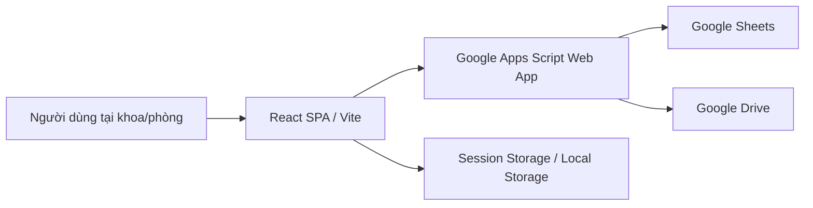
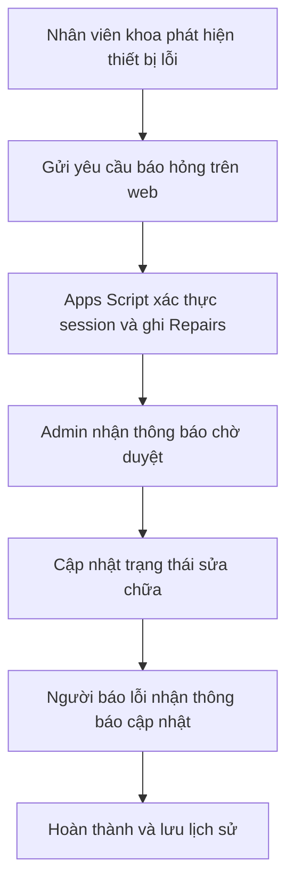
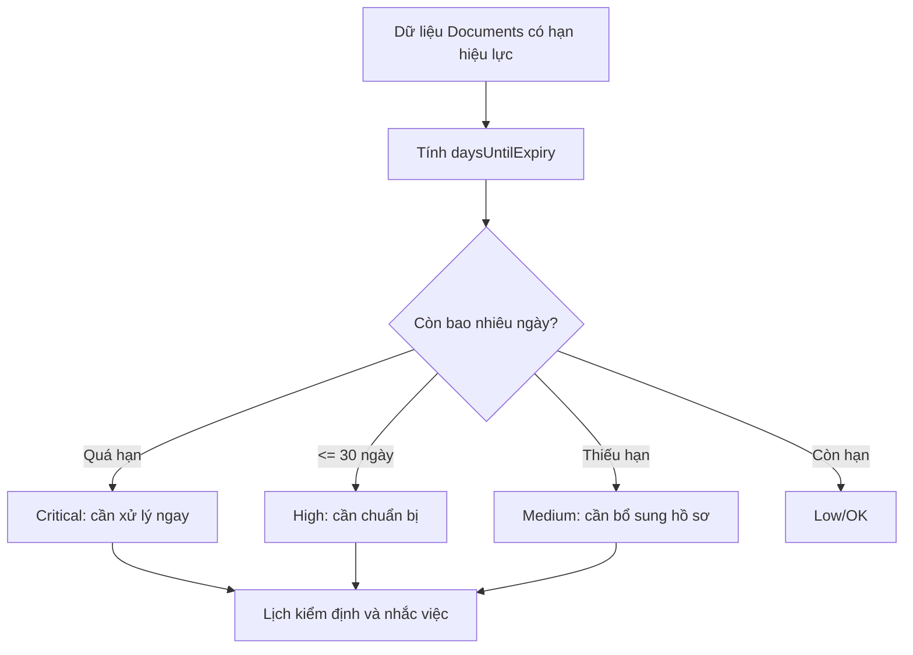

# BẢN MÔ TẢ GIẢI PHÁP DỰ THI

**Hội thi sáng tạo kỹ thuật tỉnh Phú Thọ năm 2026**

## I. THÔNG TIN CHUNG

### 1. Tên công trình, giải pháp

**Xây dựng hệ thống thông tin quản lý vòng đời trang thiết bị y tế trên nền tảng Serverless, React và Google Workspace tại Trung tâm Y tế**

Tên ngắn gọn khi ghi vào phiếu đăng ký:

**Hệ thống quản lý vòng đời trang thiết bị y tế Serverless**

### 2. Lĩnh vực dự thi

Giải pháp phù hợp đồng thời với hai nhóm lĩnh vực trong hồ sơ Hội thi:

- **Công nghệ thông tin, điện tử, viễn thông:** ứng dụng phần mềm phục vụ công tác quản lý, cải cách hành chính và giải quyết bài toán kỹ thuật nội bộ đơn vị.
- **Y, Dược:** cải tiến công tác quản lý, theo dõi, luân chuyển, sửa chữa, kiểm định và khai thác trang thiết bị y tế phục vụ khám, chữa bệnh.

### 3. Tháng, năm tạo ra và triển khai giải pháp

Giải pháp được xây dựng, hoàn thiện và đưa vào thử nghiệm trong năm **2026** trên bộ dữ liệu trang thiết bị của đơn vị. Bản hiện tại quản lý được **536 thiết bị**, **18 khoa/phòng** và **70 hồ sơ/tài liệu thiết bị** trong dữ liệu khởi tạo.

### 4. Đặt vấn đề

Trang thiết bị y tế là tài sản có giá trị lớn, liên quan trực tiếp đến chất lượng khám chữa bệnh, an toàn người bệnh và năng lực đáp ứng chuyên môn của cơ sở y tế. Tuy nhiên, tại tuyến cơ sở, công tác quản lý thiết bị thường phụ thuộc vào sổ sách, file Excel rời rạc, tin nhắn nội bộ và các biểu mẫu giấy. Cách làm này phát sinh nhiều khó khăn:

- Thông tin thiết bị bị phân tán, khó xác định nhanh thiết bị đang ở khoa nào, tình trạng sử dụng ra sao, ai đang quản lý.
- Yêu cầu báo hỏng, sửa chữa, bàn giao thiết bị chưa có luồng xử lý thống nhất; việc theo dõi tiến độ phụ thuộc vào trao đổi thủ công.
- Hồ sơ kiểm định, hạn hiệu lực, người phụ trách và tình trạng gửi hồ sơ khó được cảnh báo sớm, dễ phát sinh quá hạn.
- Báo cáo tổng hợp cho lãnh đạo mất nhiều thời gian, dữ liệu dễ sai khác giữa các bảng theo dõi.
- Nếu mua phần mềm thương mại hoặc triển khai máy chủ riêng sẽ phát sinh chi phí bản quyền, chi phí hạ tầng, chi phí vận hành và yêu cầu nhân lực kỹ thuật thường trực.

Từ thực tế đó, giải pháp được xây dựng theo hướng **phần mềm web gọn nhẹ, chi phí hạ tầng gần bằng 0, dễ triển khai trong đơn vị y tế có điều kiện CNTT hạn chế**, nhưng vẫn đáp ứng các yêu cầu cốt lõi: bảo mật phiên làm việc, phân quyền, truy vết, báo cáo, cảnh báo và mở rộng dữ liệu.

## II. NỘI DUNG GIẢI PHÁP

### 1. Khái quát các giải pháp đã biết và hạn chế cần khắc phục

Các cách quản lý phổ biến hiện nay gồm:

1. **Sổ sách và phiếu giấy:** dễ triển khai nhưng mất công tổng hợp, khó tìm kiếm, khó truy vết người xử lý và không tạo được cảnh báo tự động.
2. **Bảng Excel/Google Sheets thủ công:** có thể chia sẻ dữ liệu nhưng không có quy trình nghiệp vụ rõ ràng; người dùng có thể sửa nhầm cột, xóa nhầm dòng, khó phân quyền theo vai trò và khó tổng hợp lịch sử xử lý.
3. **Phần mềm quản lý tài sản thương mại:** đầy đủ chức năng hơn nhưng chi phí cao, phải phụ thuộc nhà cung cấp, khó tùy biến theo quy trình riêng của đơn vị y tế tuyến huyện.
4. **Ứng dụng web nội bộ có máy chủ riêng:** chủ động về kỹ thuật nhưng phải duy trì server, cơ sở dữ liệu, sao lưu, chứng thư, bảo mật và nhân lực vận hành.

Giải pháp này khắc phục các hạn chế trên bằng cách kết hợp **React SPA + Google Apps Script + Google Sheets + Google Drive**, trong đó Google Workspace đóng vai trò nền tảng dữ liệu và backend serverless, còn giao diện React đóng vai trò lớp nghiệp vụ, điều phối tác vụ và tổng hợp thông minh.

### 2. Mục đích của giải pháp

Giải pháp hướng tới các mục tiêu:

- Số hóa tập trung danh mục trang thiết bị y tế, khoa/phòng quản lý, tình trạng sử dụng, hồ sơ kiểm định và tài liệu liên quan.
- Rút ngắn quy trình báo hỏng, sửa chữa, luân chuyển và tiếp nhận thiết bị.
- Tạo cảnh báo sớm cho hồ sơ hết hạn, thiết bị cần kiểm định, yêu cầu sửa chữa chờ duyệt và phiếu bàn giao chờ tiếp nhận.
- Giảm chi phí hạ tầng CNTT bằng kiến trúc serverless không cần máy chủ riêng.
- Tăng tính minh bạch bằng lịch sử sự kiện, minh chứng ảnh/tài liệu và báo cáo xuất CSV/PDF.
- Bảo vệ dữ liệu nội bộ bằng phân quyền, token phiên làm việc, không trả về PIN/mật khẩu và xóa cache khi đăng xuất.

### 3. Nội dung chủ yếu của giải pháp kỹ thuật

#### 3.1. Kiến trúc tổng thể

Hệ thống được thiết kế theo mô hình ba lớp:



- **Lớp giao diện:** React 19, TypeScript, Vite; chạy trên trình duyệt, hỗ trợ desktop và thiết bị di động.
- **Lớp API:** Google Apps Script tiếp nhận request, xác thực phiên, kiểm tra vai trò, thực hiện CRUD và ghi nhật ký.
- **Lớp dữ liệu:** Google Sheets lưu danh mục thiết bị, người dùng, sửa chữa, luân chuyển, GSP, hồ sơ tài liệu và nhật ký hoạt động; Google Drive lưu minh chứng ảnh/tài liệu.
- **Lớp bộ nhớ cục bộ:** `sessionStorage` lưu phiên đăng nhập ngắn hạn; `localStorage` lưu trạng thái đọc thông báo, luồng công việc cá nhân và dữ liệu tạm không nhạy cảm.

Giá trị kỹ thuật quan trọng của kiến trúc này là **không cần server riêng**, không cần cơ sở dữ liệu SQL riêng, không cần triển khai VPN nội bộ, nhưng vẫn tạo được một ứng dụng quản lý có quy trình, phân quyền và báo cáo.

#### 3.2. Backend Serverless bằng Google Apps Script

File `gas/Code.gs` đóng vai trò API Gateway. Các bảng dữ liệu được chuẩn hóa thành nhóm sheet:

- `Devices`: danh mục thiết bị.
- `Users`: tài khoản, vai trò, khoa/phòng.
- `Repairs`: yêu cầu báo hỏng và xử lý sửa chữa.
- `Transfers`: phiếu luân chuyển, tiếp nhận, từ chối, hủy.
- `GSP`: nhật ký nhiệt độ/độ ẩm.
- `Documents`: hồ sơ kiểm định, hạn hiệu lực, người phụ trách, link tài liệu.
- `ActivityLogs`: nhật ký thay đổi.

Router `route_()` phân tách từng nghiệp vụ theo `action`, ví dụ: `login`, `getDevices`, `reportRepair`, `approveRepair`, `createTransfer`, `receiveTransfer`, `addDocument`, `updateDocStatus`, `addGSP`.

Mỗi nghiệp vụ ghi dữ liệu đều đi qua hai lớp chặn:

- **Xác thực phiên:** `requireAuthenticated_()` kiểm tra `sessionToken`.
- **Phân quyền:** `requireAdmin_()` chỉ cho phép Admin thực hiện các tác vụ nhạy cảm như thêm/sửa thiết bị, quản lý người dùng, import dữ liệu.

Tại thời điểm đăng nhập, backend tạo token có thời hạn bằng `createSessionToken_()` với `expiresAt = Date.now() + 12 giờ`. Token được ký bằng chữ ký riêng của Apps Script, giúp phát hiện token giả mạo hoặc hết hạn.

Điểm cải tiến quan trọng: khi trả về thông tin người dùng, backend **xóa trường `Mã PIN`, `PIN`, `Mật khẩu`, `Password`** trước khi gửi về client. Như vậy, frontend chỉ nhận thông tin định danh cần thiết, không nhận dữ liệu bí mật.

#### 3.3. Cơ chế gọi API tránh lỗi CORS và giảm phụ thuộc hạ tầng

Google Apps Script Web App có hạn chế với các request `POST application/json` vì trình duyệt có thể gửi preflight `OPTIONS`, trong khi Apps Script không xử lý linh hoạt như server Node/Express. Hệ thống khắc phục bằng cách gửi request dưới dạng **simple request**:

```typescript
headers: { 'Content-Type': 'text/plain;charset=utf-8' }
body: JSON.stringify({ action, payload })
```

Kỹ thuật này giúp:

- Trình duyệt gửi thẳng request đến Apps Script, không cần proxy trung gian.
- Giảm một vòng mạng preflight, rút ngắn độ trễ.
- Giữ payload vẫn là JSON đầy đủ, nhưng được đóng gói dưới dạng text để tương thích với Apps Script.
- Triển khai được trên mọi môi trường có Google Workspace mà không phải thuê backend.

#### 3.4. Bộ đệm dữ liệu trung tâm `useApiResource`

Trong ứng dụng web quản lý, nhiều màn hình cùng cần đọc danh sách thiết bị, yêu cầu sửa chữa, luân chuyển và người dùng. Nếu mỗi component tự gọi API riêng, hệ thống sẽ bị trùng request, chậm và dễ chạm hạn mức Apps Script.

Giải pháp xây dựng custom hook `useApiResource` với ba registry ở phạm vi module:

```typescript
const cacheRegistry = new Map<string, CacheState<unknown>>();
const promiseRegistry = new Map<string, Promise<unknown[]>>();
const subscriberRegistry = new Map<string, Set<() => void>>();
```

Cơ chế hoạt động:

- **Cache TTL 5 phút:** dữ liệu đã tải được dùng lại trong `CACHE_TTL = 5 * 60 * 1000`.
- **Request deduplication:** nếu request đang chạy, component khác dùng lại cùng Promise trong `promiseRegistry` thay vì tạo request mới.
- **Observer Pattern:** khi dữ liệu thay đổi, `notifySubscribers(key)` cập nhật đồng thời các màn hình đang lắng nghe.
- **Mutate cục bộ:** khi Admin cập nhật trạng thái sửa chữa, giao diện cập nhật ngay bằng `mutate()`; nếu backend lỗi thì refetch để khôi phục dữ liệu đúng.

Hiệu quả kỹ thuật:

- Giảm số request trùng lặp khi người dùng chuyển tab/màn hình.
- Giao diện phản hồi nhanh hơn vì dữ liệu đã có trong RAM.
- Giảm nguy cơ vượt hạn mức Google Apps Script.
- Giữ logic cache tập trung, tránh mỗi màn hình tự viết cách xử lý khác nhau.

#### 3.5. Bảo mật phiên làm việc và cách ly dữ liệu trên máy dùng chung

Tại cơ sở y tế, máy tính trực khoa thường được nhiều nhân viên dùng chung. Nếu cache hoặc token còn tồn tại sau khi đăng xuất, thông tin khoa/phòng có thể bị xem nhầm bởi người dùng tiếp theo.

Hệ thống xử lý theo ba lớp:

1. **Lưu phiên trong `sessionStorage`:** phiên bị xóa khi trình duyệt đóng, không tồn tại dài hạn như `localStorage`.
2. **Kiểm tra hạn token:** `readAuthSession()` tự động xóa phiên nếu `expiresAt <= Date.now()`.
3. **Thu hồi cache chủ động khi đăng xuất:** `AuthProvider.logout()` gọi `clearAuthSession()` và `clearApiResourceCache()`.

Hàm `clearApiResourceCache()` xóa `cacheRegistry`, `promiseRegistry` và phát tín hiệu đến tất cả subscriber để giao diện render lại trạng thái sạch. Đây là điểm then chốt giúp **chặn rò rỉ dữ liệu chéo giữa các ca trực**.

#### 3.6. Phân quyền nghiệp vụ theo vai trò và khoa/phòng

Hệ thống sử dụng Role-Based Access Control:

- **Admin:** xem và quản lý toàn bộ thiết bị, yêu cầu sửa chữa, luân chuyển, người dùng, hồ sơ, import dữ liệu.
- **Nhân viên khoa/phòng:** tạo yêu cầu báo hỏng, theo dõi yêu cầu của mình, tiếp nhận/từ chối thiết bị liên quan đến khoa mình, xem thông tin phù hợp với vai trò.

Ví dụ trên màn hình theo dõi:

- Admin xem toàn bộ `repairs` và `transfers`.
- Nhân viên chỉ thấy yêu cầu sửa chữa của mình hoặc phiếu luân chuyển có `fromDepartment`, `toDepartment`, `requestedBy` liên quan đến khoa/tài khoản hiện tại.

Phân quyền được thực hiện cả ở frontend để trải nghiệm gọn gàng, và ở backend để đảm bảo không thể bỏ qua bằng cách gọi API trực tiếp.

#### 3.7. Biên dịch thông báo động phía client

Thay vì tạo một bảng `Notifications` riêng, hệ thống biên dịch thông báo trực tiếp từ dữ liệu gốc:

- `Repairs`: yêu cầu sửa chữa mới, cập nhật trạng thái sửa chữa.
- `Transfers`: phiếu luân chuyển đang chờ tiếp nhận.
- `Devices`: tên thiết bị để hiển thị thông báo dễ hiểu.

Trong `TopNav.tsx`, danh sách thông báo được tạo bằng `useMemo()`, phụ thuộc vào vai trò người dùng:

- Admin nhận thông báo yêu cầu sửa chữa "Chờ duyệt" và phiếu luân chuyển "PENDING_RECEIVE".
- Nhân viên khoa nhận thông báo thiết bị đang chờ khoa mình tiếp nhận và cập nhật sửa chữa của chính mình.

Trạng thái đã đọc được lưu trong `localStorage` với khóa `qlttb.read_notifications`. Cách làm này không tạo thêm request ghi dữ liệu lên Google Sheets, giảm chi phí xử lý và vẫn đảm bảo trải nghiệm có chuông thông báo.

#### 3.8. Quản lý hồ sơ kiểm định và cảnh báo hạn hiệu lực

Hệ thống chuẩn hóa hồ sơ thiết bị qua `DeviceDocument`, gồm:

- Loại tài liệu.
- Số văn bản/số đăng kiểm.
- Ngày cấp/ngày đăng kiểm.
- Hạn đăng kiểm/hạn hiệu lực.
- Thời gian chuẩn bị hồ sơ.
- Trạng thái hồ sơ.
- Người chịu trách nhiệm, người phối hợp, khoa quản lý.
- Link tài liệu.

Frontend tính `daysUntilExpiry` để xếp mức cảnh báo:

- `danger`: còn 7 ngày hoặc ít hơn.
- `warning`: còn 30 ngày hoặc ít hơn.
- `ok`: còn hạn an toàn.

Module `operationalInsights.ts` tiếp tục biến dữ liệu này thành:

- Danh sách việc cần làm.
- Lịch kiểm định.
- Mức ưu tiên `critical`, `high`, `medium`, `low`.
- Trạng thái workflow `todo`, `preparing`, `submitted`, `approved`, `returned`.

Điểm mới là hệ thống không chỉ lưu "ngày hết hạn", mà biến ngày hết hạn thành **hành động cụ thể**: ai cần làm, mức độ ưu tiên nào, hồ sơ nào cần chuẩn bị trước, thiết bị nào hết hạn trước.

#### 3.9. Quy trình báo hỏng, sửa chữa và luân chuyển thiết bị

Quy trình sửa chữa:

1. Nhân viên khoa chọn thiết bị và gửi mô tả lỗi.
2. Backend tự động gán người báo lỗi và email từ phiên đăng nhập.
3. Admin tiếp nhận, cập nhật trạng thái: đang kiểm tra, đang sửa chữa, đã sửa xong, đã hoàn thành.
4. Người dùng theo dõi tiến độ trên màn hình và nhận thông báo cập nhật.

Quy trình luân chuyển:

1. Người dùng tạo phiếu chuyển thiết bị sang khoa/phòng khác.
2. Hệ thống ghi `fromDepartment`, `toDepartment`, người đề nghị, lý do, thời điểm.
3. Khoa nhận thực hiện tiếp nhận, từ chối hoặc Admin theo dõi tổng thể.
4. Lịch sử luân chuyển được đưa vào dòng sự kiện để truy vết.

Hai quy trình này biến các trao đổi bằng miệng/tin nhắn/phiếu giấy thành **chuỗi dữ liệu có trạng thái**, có người thực hiện và có thời điểm.

#### 3.10. Minh chứng ảnh/tài liệu và liên kết Drive

Giải pháp hỗ trợ gắn minh chứng vào mô tả nghiệp vụ. Các dòng có định dạng:

```text
[Ảnh minh chứng]: https://...
```

được `evidenceUtils.ts` trích thành liên kết riêng, hiển thị bằng component `EvidenceLinks`. Cách làm này có hai lợi ích:

- Nội dung nghiệp vụ vẫn đọc được gọn gàng vì link minh chứng được tách khỏi mô tả chính.
- Có thể dẫn đến ảnh/tài liệu trên Google Drive mà không cần xây dựng hệ thống lưu file riêng.

#### 3.11. Báo cáo, xuất dữ liệu và hỗ trợ quyết định

Màn hình báo cáo tổng hợp các nhóm dữ liệu:

- Sửa chữa đang xử lý và đã hoàn thành.
- Hồ sơ kiểm định còn hạn, sắp hết hạn, hết hạn, thiếu hạn hiệu lực, đã gửi/duyệt.
- Lọc theo khoa/phòng và khoảng thời gian.
- Xuất CSV để tổng hợp tiếp trên Excel.
- Xuất PDF bằng `jsPDF` và `jspdf-autotable`.

Màn hình vận hành (`Operations`) bổ sung:

- Lịch kiểm định theo tháng.
- Nhắc việc hồ sơ.
- Dòng lịch sử thiết bị gồm sửa chữa, luân chuyển, kiểm định, chi phí.
- Ghi nhận chi phí bảo trì/sửa chữa.
- Tạo QR thiết bị và preview import dữ liệu.

Như vậy, hệ thống không chỉ là "danh sách thiết bị", mà là công cụ quản lý vòng đời: từ cập nhật, khai thác, sửa chữa, điều chuyển, kiểm định đến báo cáo.

#### 3.12. Chế độ dữ liệu snapshot để kiểm thử và vận hành dự phòng

Dự án có file `src/data/devices.snapshot.json` cho phép bật biến môi trường:

```bash
VITE_USE_LOCAL_SNAPSHOT=true
```

Khi bật chế độ này, danh sách/tổng quan thiết bị có thể đọc từ snapshot nội bộ mà không cần gọi API. Đây là cải tiến hữu ích cho:

- Kiểm thử giao diện khi chưa deploy Apps Script.
- Trình diễn giải pháp không phụ thuộc mạng.
- Dự phòng đọc dữ liệu khi backend tạm thời lỗi.

### 4. Kết quả kỹ thuật đạt được

Giải pháp hiện đã hình thành các chỉ tiêu kỹ thuật cụ thể:

- Quản lý được tập dữ liệu khởi tạo **536 thiết bị**, **18 khoa/phòng**, **70 hồ sơ/tài liệu**.
- Có backend serverless trên Google Apps Script, không cần máy chủ riêng.
- Có phân quyền Admin/User và token phiên 12 giờ.
- Không trả về PIN/mật khẩu trong response người dùng.
- Có cache trung tâm TTL 5 phút và chống request trùng lặp.
- Có quy trình báo hỏng, sửa chữa, luân chuyển, tiếp nhận, từ chối, hoàn trả.
- Có module cảnh báo hạn hồ sơ/kiểm định theo số ngày còn lại.
- Có thông báo động theo vai trò, không cần bảng notification riêng.
- Có xuất CSV/PDF, QR, import preview, minh chứng ảnh/tài liệu.
- Có bộ test tự động cho các module nghiệp vụ chính trong thư mục `tests/`.

## III. ĐÁNH GIÁ GIẢI PHÁP

### 1. Tính mới

So với cách quản lý bằng giấy/Excel riêng lẻ, giải pháp có các điểm mới:

- Chuyển từ quản lý tĩnh sang **quản lý có trạng thái và quy trình**.
- Biến Google Sheets từ bảng nhập liệu thủ công thành cơ sở dữ liệu có API, có phân quyền và có kiểm tra nghiệp vụ.
- Kiểm định hồ sơ không chỉ lưu ngày hết hạn mà tự động tính mức cảnh báo, ưu tiên và việc cần làm.
- Thông báo được sinh động từ dữ liệu gốc, không tạo bảng trung gian và không cần polling liên tục.
- Cache dữ liệu được quản lý tập trung ở frontend, giúp ứng dụng serverless vẫn có tốc độ phản hồi tốt.
- Có cơ chế xóa cache khi đăng xuất, phù hợp môi trường máy tính dùng chung tại khoa/phòng.

### 2. Tính sáng tạo

Điểm sáng tạo cốt lõi nằm ở việc tận dụng hạ tầng sẵn có của Google Workspace để tạo một hệ thống gần như không tốn chi phí hạ tầng, nhưng vẫn áp dụng các kỹ thuật của phần mềm hiện đại:

- **Serverless API Gateway:** Apps Script đóng vai trò backend, Google Sheets đóng vai trò database.
- **CORS simple request:** dùng `text/plain;charset=utf-8` để gửi JSON đến Apps Script mà không cần proxy.
- **Registry Pattern + Observer Pattern:** xây dựng cache và đồng bộ giao diện bằng `useApiResource`.
- **Client-side notification compilation:** tạo thông báo theo role từ `Repairs` và `Transfers`.
- **Active cache garbage collection:** xóa cache và thông báo subscriber khi đăng xuất để bảo vệ dữ liệu.
- **Compliance engine:** tính hạn kiểm định, mức ưu tiên, workflow và lịch công việc từ dữ liệu hồ sơ.
- **Hybrid online/offline snapshot:** có snapshot để kiểm thử và demo khi chưa có backend.

### 3. Khả năng áp dụng

Giải pháp có khả năng áp dụng cao tại:

- Trung tâm Y tế tuyến huyện.
- Bệnh viện đa khoa khu vực.
- Trạm y tế/phòng khám có danh mục thiết bị cần theo dõi.
- Khoa dược, khoa xét nghiệm, khoa chẩn đoán hình ảnh, phòng vật tư - thiết bị y tế.

Điều kiện áp dụng tối thiểu:

- Có tài khoản Google Workspace hoặc Gmail được phép tạo Google Sheets/Apps Script.
- Có máy tính hoặc điện thoại có trình duyệt web.
- Có người quản trị ban đầu nhập danh mục thiết bị và tài khoản người dùng.

Giải pháp dễ nhân rộng vì mỗi đơn vị chỉ cần sao chép bộ Google Sheets, deploy Apps Script mới, cập nhật endpoint trong biến môi trường `VITE_THIET_BI_API_URL` và build lại frontend.

### 4. Hiệu quả kinh tế

Hiệu quả kinh tế thể hiện ở các khoản giảm chi phí:

- **Không phải mua server:** Google Apps Script và Google Sheets đảm nhận backend/database cho quy mô nội bộ.
- **Không phải mua bản quyền phần mềm thương mại:** mã nguồn được đơn vị làm chủ, có thể tiếp tục tùy biến.
- **Giảm thời gian tổng hợp báo cáo:** dữ liệu sửa chữa, luân chuyển, kiểm định, chi phí đã có sẵn để lọc và xuất.
- **Giảm chi phí sửa chữa lớn:** báo hỏng sớm và theo dõi tiến độ giúp xử lý sự cố nhỏ trước khi thành hư hỏng nặng.
- **Giảm thiết bị nhàn rỗi:** theo dõi vị trí và luân chuyển giúp khoa thừa có thể chuyển sang khoa thiếu, tăng hiệu suất khai thác tài sản.

Nếu so với phương án thuê server riêng, chi phí hạ tầng có thể giảm về gần **0 đồng/tháng** trong giai đoạn triển khai nội bộ. Nếu so với quản lý giấy/Excel, lợi ích lớn nhất là giảm giờ công hành chính và giảm sai sót do tổng hợp thủ công.

### 5. Hiệu quả kỹ thuật

Giải pháp mang lại các hiệu quả kỹ thuật rõ ràng:

- Một nguồn dữ liệu tập trung thay cho nhiều file rời rạc.
- Truy vấn nhanh hơn nhờ cache TTL và request deduplication.
- Giao diện cập nhật động sau khi mutate, không cần tải lại trang.
- Phân quyền và token phiên giảm nguy cơ truy cập trái phép.
- Báo cáo, cảnh báo và lịch kiểm định được tính từ dữ liệu thật, tránh nhập lại nhiều lần.
- Dễ bảo trì vì code chia thành module: services, hooks, pages, utils, components.
- Có test tự động cho logic thống kê, trạng thái thiết bị, thông báo, dashboard, API endpoint, import snapshot và UI nghiệp vụ.

### 6. Hiệu quả xã hội và quản lý

- Nhân viên khoa/phòng có thể báo hỏng thiết bị ngay tại nơi sử dụng, không phải viết phiếu và di chuyển qua nhiều bộ phận.
- Bộ phận phụ trách thiết bị theo dõi được yêu cầu mới, tiến độ sửa chữa và lịch sử xử lý.
- Lãnh đạo có dữ liệu tổng hợp để ra quyết định về sửa chữa, điều chuyển, mua sắm, kiểm định.
- Tăng minh bạch vì mỗi sự kiện quan trọng gắn với người thực hiện, thời điểm và trạng thái.
- Góp phần đảm bảo an toàn người bệnh vì thiết bị hỏng, hết hạn kiểm định hoặc thiếu hồ sơ được cảnh báo sớm.
- Giảm sự phụ thuộc vào một cá nhân nắm giữ file Excel, giúp công tác bàn giao nhân sự dễ dàng hơn.

### 7. Hiệu quả môi trường

Giải pháp giảm sử dụng giấy trong các quy trình:

- Báo hỏng/sửa chữa.
- Bàn giao/luân chuyển.
- Tổng hợp báo cáo.
- Theo dõi hồ sơ kiểm định.

Đồng thời, việc khai thác lại thiết bị thông qua luân chuyển nội bộ giúp hạn chế mua sắm trùng lặp, giảm lãng phí tài sản công.

## IV. PHỤ LỤC MINH HỌA VÀ MINH CHỨNG KỸ THUẬT

### 1. Mã nguồn tiêu biểu trong dự án

- `src/services/api.ts`: lớp API frontend, đóng gói payload, xử lý Apps Script endpoint, parse dữ liệu thiết bị/hồ sơ.
- `gas/Code.gs`: backend serverless, route nghiệp vụ, phân quyền, tạo/kiểm tra session token.
- `src/hooks/useApiResource.ts`: cache registry, promise registry, subscriber registry.
- `src/AuthProvider.tsx` và `src/authSession.ts`: quản lý phiên, token, đăng xuất và xóa cache.
- `src/components/layout/TopNav.tsx`: biên dịch thông báo động theo vai trò.
- `src/utils/operationalInsights.ts`: tính cảnh báo kiểm định, việc cần làm, lịch sử, chi phí.
- `src/pages/Reports.tsx`: báo cáo thống kê, lọc hồ sơ, xuất CSV/PDF.
- `src/pages/Operations.tsx`: lịch kiểm định, nhắc việc, QR, import preview, chi phí.
- `src/components/EvidenceLinks.tsx`: hiển thị minh chứng ảnh/tài liệu.

### 2. Sơ đồ luồng báo hỏng thiết bị



### 3. Sơ đồ luồng kiểm định hồ sơ



### 4. Đề xuất bộ hồ sơ nộp kèm

Theo Phụ lục hồ sơ Hội thi, bộ hồ sơ nên gồm:

- Phiếu đăng ký dự thi.
- Bản mô tả giải pháp dự thi.
- Ảnh chụp màn hình các module: Dashboard, danh sách thiết bị, báo hỏng, theo dõi sửa chữa, luân chuyển, báo cáo, lịch kiểm định.
- Bản in một số báo cáo CSV/PDF mẫu.
- Biên bản/nhận xét của đơn vị nếu đã thử nghiệm trong thực tế.
- Bản mô tả cấu trúc Google Sheets và Apps Script endpoint.

## V. CAM ĐOAN

Giải pháp trên được xây dựng từ nhu cầu thực tế trong công tác quản lý trang thiết bị y tế tại đơn vị, áp dụng các công nghệ phổ biến, dễ kiểm chứng và có khả năng nhân rộng. Nội dung mô tả tập trung vào các thành phần kỹ thuật đã có trong dự án và các hiệu quả quản lý có thể đạt được khi áp dụng vào quy trình làm việc thực tế.

*Phú Thọ, ngày ...... tháng ...... năm 2026*

**Tác giả / Đại diện nhóm tác giả**
